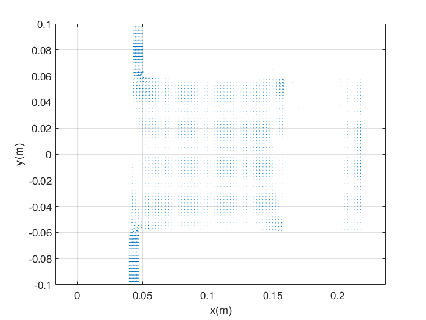

# Magnetic Levitation Train
  
Simulation of electromagnectic effects on a magnetic levitation train using the Finite Difference Method. 

 

Sample of the results (magnetic field intensity vectors over the cross section of the electromagnet):

Several other plots are shown in the folder *plots*.
